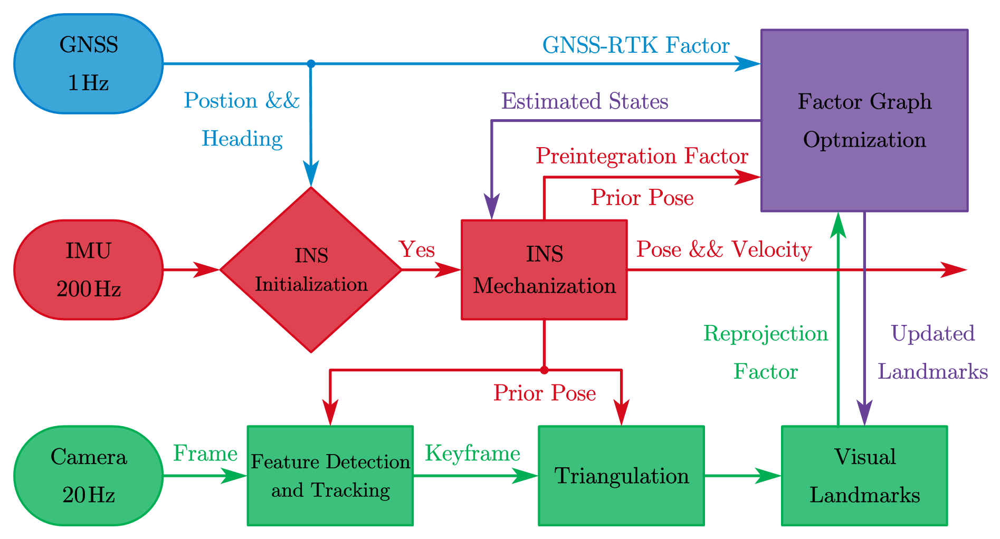
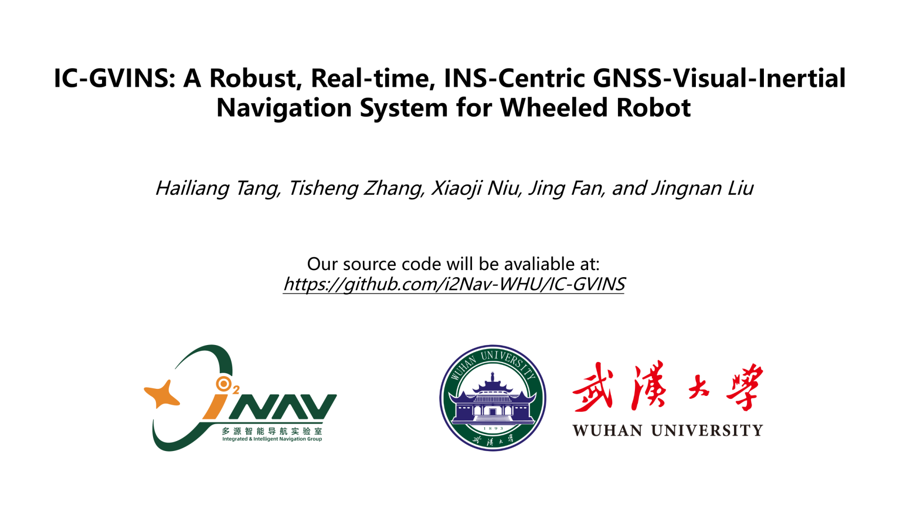
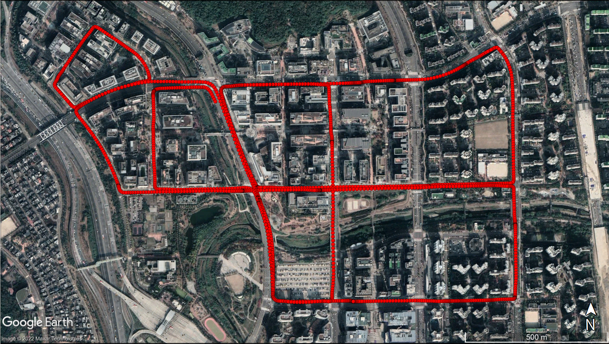
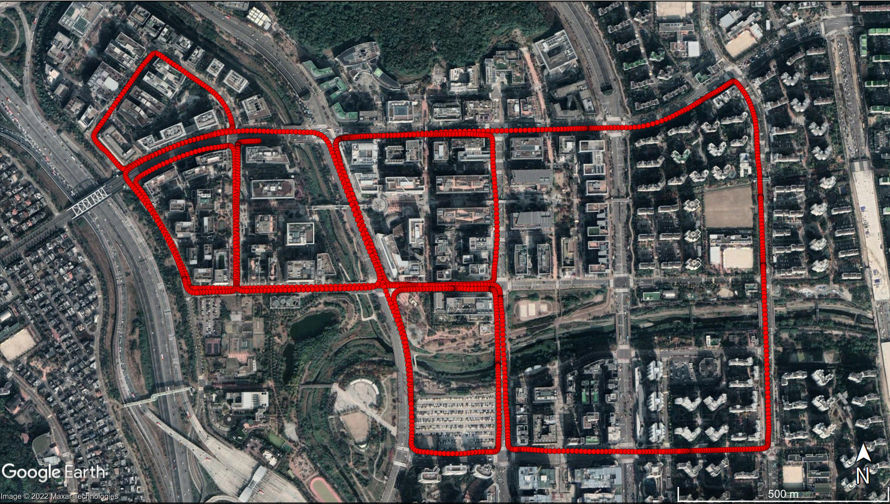
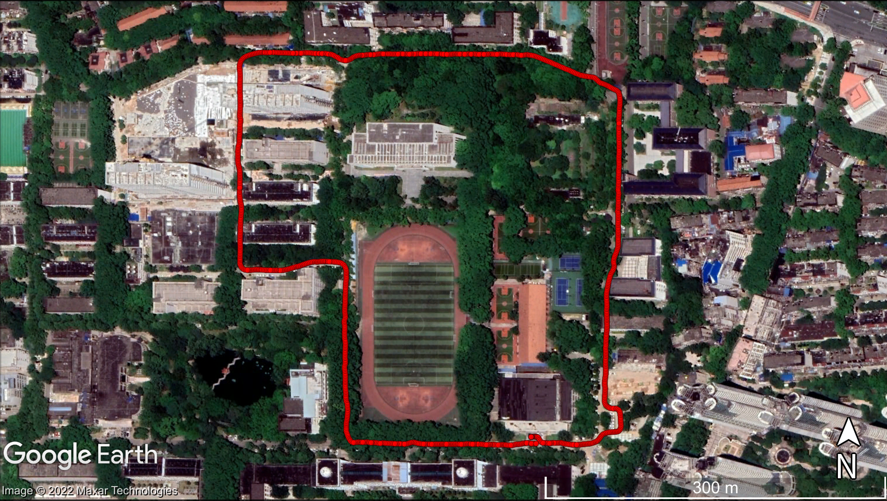
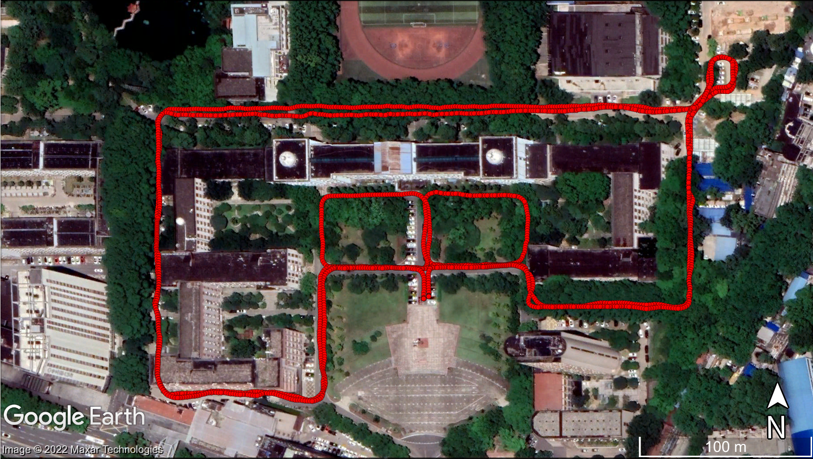

# IC-GVINS

## A Robust, Real-time, INS-Centric GNSS-Visual-Inertial Navigation System

Visual navigation systems are susceptible to complex environments, while inertial navigation systems (INS) are not affected by external factors. Hence, we present IC-GVINS, a robust, real-time, INS-centric global navigation satellite system (GNSS)-visual-inertial navigation system to fully utilize the INS advantages. The Earth rotation has been compensated in the INS to improve the accuracy of high-grade inertial measurement units (IMUs). To promote the system robustness in high-dynamic conditions, the precise INS information is employed to assist the feature tracking and landmark triangulation. With a GNSS-aided initialization, the IMU, visual, and GNSS measurements are tightly fused in a unified world frame within the factor graph optimization framework.



**Authors:** Hailiang Tang, Xiaoji Niu, and Tisheng Zhang from the [Integrated and Intelligent Navigation (i2Nav) Group](http://www.i2nav.com/), Wuhan University.

**Related Paper:**

- Xiaoji Niu, Hailiang Tang, Tisheng Zhang, Jing Fan, and Jingnan Liu, “IC-GVINS: A Robust, Real-time, INS-Centric GNSS-Visual-Inertial Navigation System,” *IEEE Robotics and Automation Letters*, 2022.
- Hailiang Tang, Tisheng Zhang, Xiaoji Niu, Jing Fan, and Jingnan Liu, “Impact of the Earth Rotation Compensation on MEMS-IMU Preintegration of Factor Graph Optimization,” *IEEE Sensors Journal*, 2022.

**Related Video**:

Click the following image to open our video on [Bilibili](https://www.bilibili.com/video/BV15a411q71D).
<a href ="https://www.bilibili.com/video/BV15a411q71D"></a>

**Contacts:**

- For any technique problem, you can send an email to Dr. Hailiang Tang (thl@whu.edu.cn).
- For Chinese users, we also provide a QQ group (481173293) for discussion. You are required to provide your organization and name.

## 1 Prerequisites

### 1.1 System and compiler

We recommend you use Ubuntu 18.04 or Ubuntu 20.04 with the newest compiler (**gcc>=8.0 or clang>=6.0**). 

```shell
# gcc-8
sudo apt install gcc-8 g++-8

# Clang
# sudo apt install clang
```

### 1.2 Robot Operating System (ROS)

Follow [ROS Melodic installation instructions for Ubuntu 18.04](https://wiki.ros.org/melodic/Installation/Ubuntu) and [ROS Noetic installation instructions for Ubuntu 20.04](http://wiki.ros.org/noetic/Installation/Ubuntu).

### 1.3 Ceres Solver with its Dependencies

We use Ceres Solver to solve the non-linear least squares problem in IC-GVINS. The supported version is **Ceres Solver 2.0.0 or 2.1.0**. Please follow [Ceres installation instructions](http://ceres-solver.org/installation.html).

The dependencies **Eigen (>=3.3.7)**, **TBB**, **glog (>=0.4.0)** are also used in IC-GVINS. You can install them as follows:

```shell
sudo apt install libeigen3-dev libgoogle-glog-dev libtbb-dev
```

If the version cannot be satisfied in your system repository, you should build them from the source code.

### 1.4 OpenCV

The supported version is **OpenCV (>=3.2.0)**. You can install OpenCV from your system repository or build from the source code. OpenCV 4 is also supported in IC-GVINS.

```
sudo apt install libopencv-dev
```

### 1.5 yaml-cpp

```shell
sudo apt install libyaml-cpp-dev
```

## 2 Build and run IC-GVINS

### 2.1 Build the source code

```shell
# Make workspace directory
mkdir ~/gvins_ws && cd ~/gvins_ws
mkdir src && cd src

# Clone the repository into src directory
git clone https://github.com/i2Nav-WHU/IC-GVINS.git

# To gvins_ws directory
cd ..

# Build the source code using catkin_make
# For gcc
catkin_make -j8 -DCMAKE_BUILD_TYPE=Release -DCMAKE_C_COMPILER=gcc-8 -DCMAKE_CXX_COMPILER=g++-8
# For clang
# catkin_make -j8 -DCMAKE_BUILD_TYPE=Release -DCMAKE_C_COMPILER=clang -DCMAKE_CXX_COMPILER=clang++
```

### 2.2 Run demo dataset

If you have already downloaded the open-sourced dataset, run the following commands.

```shell
# Open a terminal and source the workspace environments
# For bash
source ~/gvins_ws/devel/setup.bash
# For zsh
# source ~/gvins_ws/devel/setup.zsh

# Run IC-GVINS node
# You should change the path in both the configuration file and command line
roslaunch ic_gvins ic_gvins.launch configfile:=path/urban38/IC-GVINS/gvins.yaml

# Open another terminal to play the ROS bag
rosbag play path/urban38/urban38.bag
```

## 3 Datasets

### 3.1 Format

We use standard ROS bag for IC-GVINS. The employed messages are as follows:

| Sensor   | Message                                                                                 | Default Topic | KAIST Dataset (Hz) | IC-GVINS Dataset (Hz) |
| ---------- | ----------------------------------------------------------------------------------------- | --------------- | -------------------- | ----------------------- |
| Camera   | [sensor_msgs/Image](http://docs.ros.org/en/api/sensor_msgs/html/msg/Image.html)         | /cam0         | 10                 | 20                    |
| IMU      | [sensor_msgs/Imu](http://docs.ros.org/en/api/sensor_msgs/html/msg/Imu.html)             | /imu0         | 100                | 200                   |
| GNSS-RTK | [sensor_msgs/NavSatFix](http://docs.ros.org/en/api/sensor_msgs/html/msg/NavSatFix.html) | /gnss0        | 1                  | 1                     |

The IMU should be in **front-right-down** format in the IC-GVINS.

### 3.2 KAIST Complex Urban Dataset

The tested sequences are *urban38* and *urban39*.

| Sequence         | Time length (seconds) | Trajectory Length (m) | Baidu Cloud Link                                                      |
| ------------------ | ----------------------- | ----------------------- | ----------------------------------------------------------------------- |
| urban38 (top)    | 2154                  | 11191                 | [urban38.bag](https://pan.baidu.com/s/1CJj0Z1vClU4aL8zSna-LzQ) (gyvr) |
| urban39 (bottom) | 1856                  | 10678                 | [urban39.bag](https://pan.baidu.com/s/14CHl7LaIIkBKpwhyuPPbPA) (mnrn) |





### 3.3 IC-GVINS Robot Dataset

We also open source our self-collected robot dataset.

| Sequence          | Time length (seconds) | Trajectory Length (m) | Baidu Cloud Link                                                       |
| ------------------- | ----------------------- | ----------------------- | ------------------------------------------------------------------------ |
| campus (top)      | 950                   | 1337                  | [campus.bag](https://pan.baidu.com/s/18yRYUQdu_-DmrYnXQy9VNQ) (igks)   |
| building (bottom) | 1820                  | 2560                  | [building.bag](https://pan.baidu.com/s/1Y48jFmdAOBF4y30KBK9bAw) (2drg) |





### 3.4 Your own dataset

You can run IC-GVINS with your self-collected dataset. Keep in mind the following notes:

1. You should prepare well-synchronized GNSS, Camera, and IMU data in a ROS bag;
2. The IMU data should be in front-right-down format;
3. Modify the topic names in the ic_gvins.launch file;
4. Modify the parameters in the configuration file.

### 3.5 Evaluation

We use [evo](https://github.com/MichaelGrupp/evo) to evaluate the TUM trajectory files. We also provide some useful scripts ([evaluate_odometry](https://github.com/i2Nav-WHU/evaluate_odometry)) for evaluation.

## 4 Acknowledgements

We thanks the following projects for the helps in developing and evaluating the IC-GVINS:

- [OB_GINS](https://github.com/i2Nav-WHU/OB_GINS): An Optimization-Based GNSS/INS Integrated Navigation System
- [VINS-Fusion](https://github.com/HKUST-Aerial-Robotics/VINS-Fusion): An optimization-based multi-sensor state estimator
- [Complex Urban Dataset](https://sites.google.com/view/complex-urban-dataset): Complex Urban Dataset with Multi-level Sensors from Highly Diverse Urban Environments
- [evo](https://github.com/MichaelGrupp/evo): Python package for the evaluation of odometry and SLAM

## 5 License

The source code is released under GPLv3 license.

We are still working on improving the code. For any technical issues, please contact Dr. Hailiang Tang ([thl@whu.edu.cn](mailto:thl@whu.edu.cn)) or open an issue at this repository.

For commercial usage, please contact Prof. Xiaoji Niu ([xjniu@whu.edu.cn](mailto:xjniu@whu.edu.cn)).
